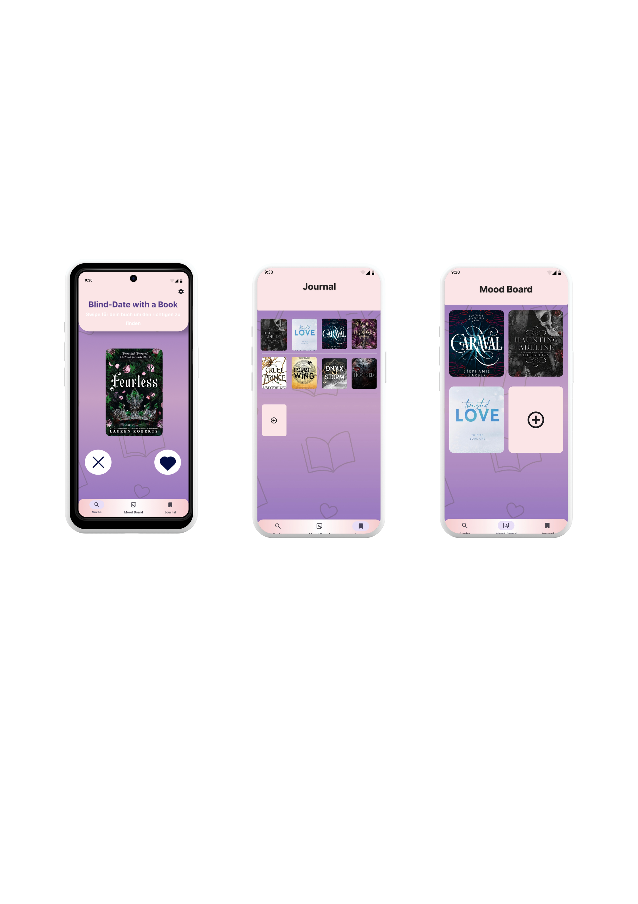
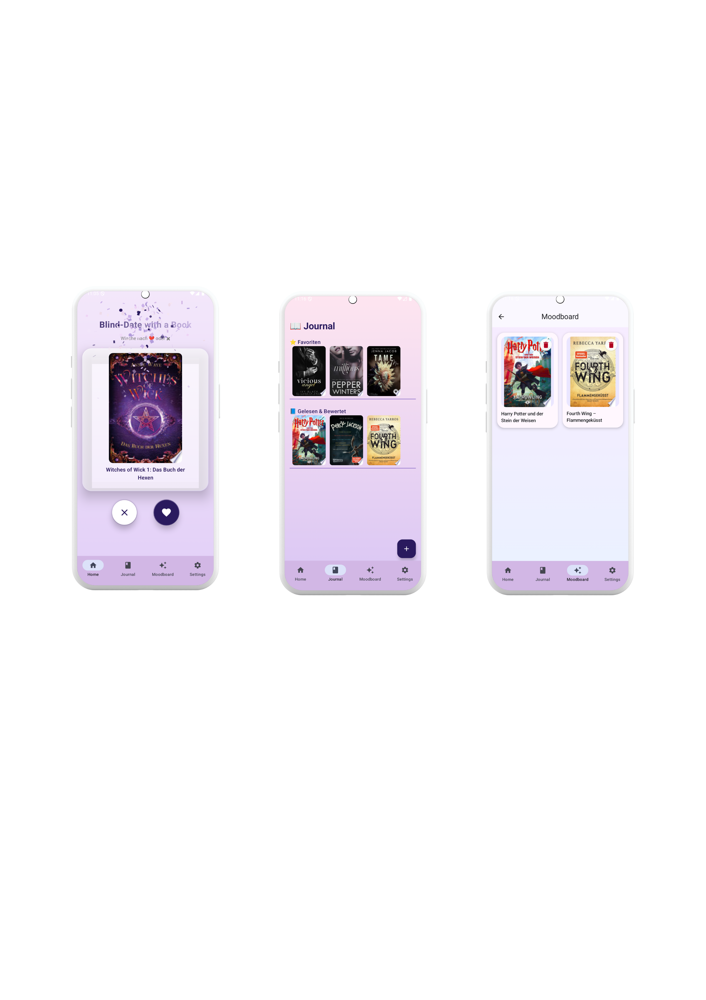

# BookFusion — Blind-Date with a Book 📚💘

> **Prolog**  
> Ich wollte keine endlosen Listen mehr — ich wollte, dass *Bücher mich finden*. Ein Swipe, ein Gefühl, fertig. So ist **BookFusion** entstanden: eine kleine, fokussierte App, die Lesen wie ein Match behandelt.

---

## Was die App macht (kurz & klar)

- **Blind-Date**: Wische durch  Titel aus **Fantasy, Romantasy, Dark Romance, Romance, Young Adult**.  
  **❤️ Like** → landet in deinem Regal (Snackbar). **✖ Dislike** → wird nicht gespeichert und sofort ersetzt.  
  Tipp aufs Cover öffnet ein **Detail-Sheet**.

- **Journal**: Zwei Regale – **⭐ Favoriten** und **📘 Gelesen & Bewertet**.  
  Bottom Sheets für **Bewertung**, **Notizen** und **Moodboard öffnen**. Manuelle Einträge sind möglich.

- **Moodboard**: Sammle Bilder zu einem Buch.  
  **Übersicht → Intro → Detail** mit **Unsplash-Suche**; ein Tap speichert das Foto in dein Moodboard.

---

## Tech & Dienste

- **Jetpack Compose (Material 3)** – moderne, deklarative UI (Snackbars, Bottom Sheets, Grids).
- **Firebase Auth** – E-Mail/Passwort-Login; steuert, ob benutzerbezogene Daten geladen werden.
- **Firebase Firestore** 
  
- **Google Books API** – liefert Buchdaten & Cover; gezielter Genre-Fokus (Fantasy/Romance/YA) und Ausschluss von Self-Help/Biografien.
- **Unsplash API** – Bildsuche fürs Moodboard; Treffer mit Metadaten speichern.
- **Performance** – ein kleiner **Vorlade-Pool** holt im Hintergrund neue Titel, damit nach Like/Dislike sofort ein neues Buch erscheint (ohne Wiederholungen).

---

## Screens

### 1) Blind-Date
Discovery via Swipe. Likes speichern sofort und ziehen das nächste Buch. Dislikes werden verworfen.  
**Snackbar:** *„✨ ‚Titel‘ steht jetzt in deinem Regal!“*  
**Detail-Sheet:** Kurze Infos, ohne den Flow zu verlassen.

### 2) Journal
Dein Regal: **Favoriten** und **Gelesen & Bewertet**.  
Pro Buch: **Bewerten**, **Notizen**, **Moodboard öffnen**, **manuelle Einträge**.

### 3) Moodboard
- **Übersicht:** Karten pro Buch (Cover, Fotoanzahl, Löschen mit Bestätigung).  
- **Intro:** Großes Cover, Status, „Bilder hinzufügen“.  
- **Detail:** Gespeicherte Bilder oben; unten **Unsplash-Suche** zum Hinzufügen.

---

## Bilder

### Hi-Fis

  

### Fertige App-Screens
**Blind-Date (App)**  

  

---

## Setup

1. **Firebase verbinden**  
   - `google-services.json` ins `app/`-Modul.  
   - **Authentication → E-Mail/Passwort** aktivieren.  
   - **Firestore** (native Mode) anlegen.

2. **API-Keys hinterlegen**  
   - **Unsplash** (für Moodboard-Suche)  
   - **Google Books** (für Buchdaten & Cover)  
   > Schlüssel sicher über `local.properties`/`BuildConfig`/Secrets verwalten.

3. **Build & Run**  
   - App starten → Login/Signup → du landest im **Blind-Date**.

---

## Wie der Code grob arbeitet

- **ViewModels** kapseln Zustand & Logik (Swipe, Like/Dislike, Vorlade-Pool, Firestore-Sync).  
- **Repository-Layer** spricht mit Google Books/Unsplash/Firebase.  
- **Compose Screens** rendern UI (Listen, Grids, Sheets, Snackbars) und rufen ViewModel-Funktionen.

---

> **Epilog**  
> BookFusion ist mein kleines Ritual: *ein Swipe, ein Herz, eine Erinnerung*.  
> Vielleicht wartet dein nächstes Lieblingsbuch schon hinter dem nächsten Swipe. ✨
